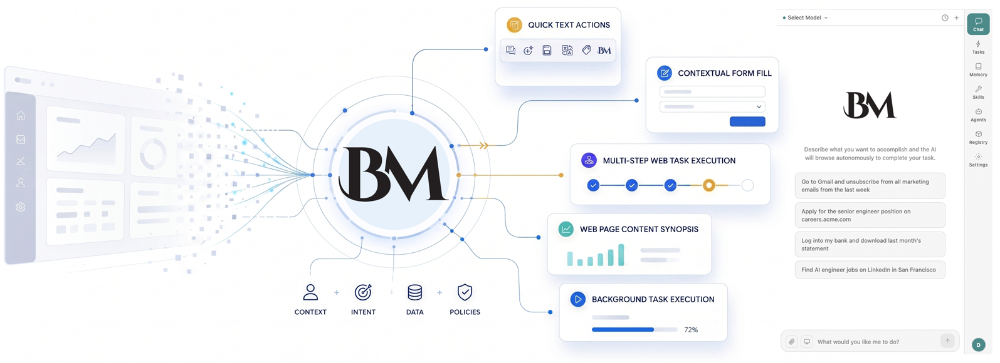

# BrowserMemex



Prebuilt browser extension for [BrowserMemex](https://browsermemex.com).
Chrome and Firefox in one place. Load it without building anything.

The source, build scripts, and release tooling live in a separate
development repository. This repository carries only the ready-to-load
builds and a short installation guide.

| Artefact | Reference |
|---|---|
| Website | <https://browsermemex.com> |

---

## Repository layout

```
bm-plugin/
├── chrome/                       Unpacked Chrome (MV3) build. Load this
│                                 folder via chrome://extensions.
├── firefox/                      Unpacked Firefox (MV3) build. Load
│                                 firefox/manifest.json via
│                                 about:debugging.
├── browser-memex-chrome.zip      Same Chrome build, zipped. Use this for
│                                 the Chrome Web Store submission.
├── browser-memex-firefox.zip     Same Firefox build, zipped. Use this
│                                 for the Mozilla Add-on submission.
└── README.md
```

## Install in Chrome

1. Open `chrome://extensions`.
2. Enable Developer mode (top-right toggle).
3. Click "Load unpacked".
4. Select the `chrome/` folder from this repository.

The BrowserMemex icon appears in the toolbar. Click it to open the side
panel.

## Install in Firefox

1. Open `about:debugging#/runtime/this-firefox`.
2. Click "Load Temporary Add-on...".
3. Select `firefox/manifest.json` from this repository.

The BrowserMemex icon appears in the toolbar. Open the sidebar with
View > Sidebar > BrowserMemex, or click the toolbar icon.

Firefox removes temporary add-ons when the browser restarts. A signed
`.xpi` will be published on Mozilla Add-ons once review is complete.

## First-time setup

1. Open the side panel. Pick a workspace name when prompted, or keep the
   default.
2. Open the Agents tab.
3. Pick the AI you use. Copy the displayed configuration snippet into
   that AI's MCP settings. Restart it.
4. The new tools (`memex_memory_query`, `memex_skills_run`,
   `memex_tasks_create`, and so on) appear in that AI.

All memory, schedules, and skills are stored on your computer. Nothing
is uploaded.

## Reporting issues

Open an issue on this repository with:

- Browser and version.
- The steps you took.
- What you expected to happen.
- What happened instead.
- Console output from the side panel (right-click > Inspect > Console)
  if anything errored.
